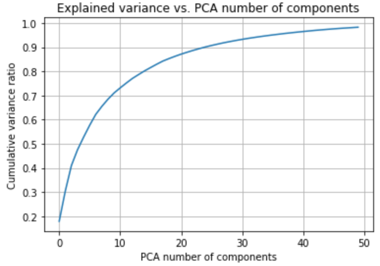
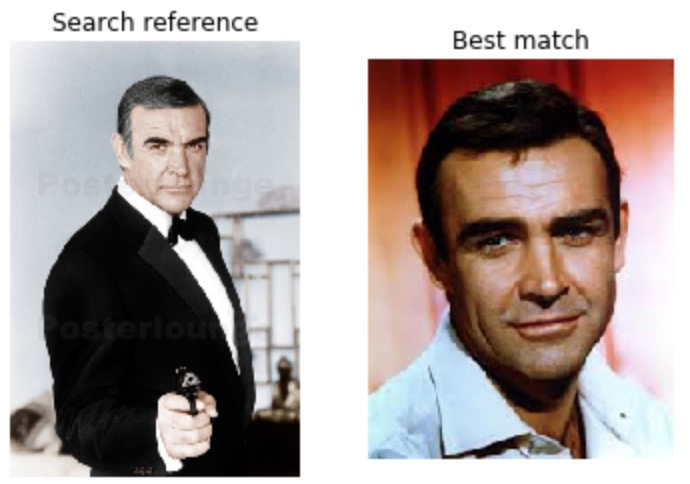

# Face search

This program implements very simple functionality: Reads image library from hard disk and detects the faces from the images. When user gives a reference image that contains a face, the program searches the library and gives the image that contains most similar looking face. 

This was a fun weekend project that I did when I wanted to try how easily one can implement photo searching solution using machine learning algorithms in a 'transfer learning' way. Transfer learning means that the machine learning algorithms use parameters that have been trained earlier using similar data, i.e. there is no need for heavy processing to get benefits of the machine learning technology. If you have all the Python libraries installed, this program gives first results in a couple of minutes without any GPU acceleration or state-of-the-art CPU. 

# Implementation

This code is implemented fully in Python 3.6 in Jupyter Notebook format. 

This program uses two kinds of pre-trained algorithms:
* Haar cascade face detection from OpenCV.
* VGG16 convolutional neural network (CNN) from Keras library that has been trained using Imagenet data. 

The VGG16 model has been originally trained using Imagenet images that are categorized to 1000 classes (cats, dogs, etc.). The model outputs the best matching class information when you input image to the model. Those classes are useless in this program, so in the code I modify the VGG16 by removing the original output layer and using the 2nd last layer as output. That layer is 1 x 4096 dimensional and the most interesting thing is that it contains much richer set of information than the original output, since it has not been force-trained to specific one-hot categories. In this use case it is not necessary to know what the output means, since we are only interested about the differences of the values between images. The 4096 dimensional vectors are reduced to 50 dimensions using Principal Component Analysis transformation. Those 50 dimensional vectors are used as embeddings for image comparison. 

Embeddings have useful characteristic that similar images produce embedding vectors that are similar. The similarity is typically measured by calculating euclidean distance or cosine distance between the vectors. In this program the cosine distance worked better, but the euclidean code is also available for anyone interested to try it. 

The overall program process is following: 

__Image library analysis:__
1. Read images from library folder. 
2. Detect faces from the images using OpenCV Haar cascade detector. 
3. Crop the faces from the images. 
4. Scale the cropped face images to 224x224 for VGG16 neural network model.
5. Feed the face images to VGG16 and read the output 4096 dimensional vectors. 
6. Run the 4096 dimensional vectors through PCA (Principal Component Analysis) transformation to reduce the dimensions to 50. 
7. Save the 50 dimensional vectors for image searching purposes. 

__Image search:__ 
1. Read a reference image given by the user. 
2. Crop the face, run the face image to VGG16, get the output vector and PCA transform it. 
3. Calculate cosine distance from the reference image embedding vector to all library image embeddings. 
4. Select the library image that has smallest cosine distance to the reference image. 
5. Return the best match image path to the user. 

I tested about half dozen different Keras pre-trained models and the VGG16 worked most predictably. The usual all-around workhorse Resnet50 had much more random looking output vectors that were not so usable in image comparisons.

The 50 component PCA seems to be well enough for this application. Below is a cumulative explained variance ratio curve from the PCA model. 

PCA is not absolutely must for this program and one can run the comparisons using the raw 4096 dimensional vectors from the VGG16. However, it looks that those raw vectors contain much 'noise' that sometimes degrade the image search results, so I recommend using PCA.

Below is sample of the search result. The image on the left was used as a reference for the search and the image on the right is the output from the algorithm. 

# Things to take into account

Since this is simple example that is intended for playing around with machine learning, it is not perfect. There are some things to take into account: 
* This program finds similar looking _images_ of faces. The face illumination, make-up, hair style and everything will affect the search results. The algorithm does not understand anything about the face itself, so be very careful if using solutions like this in any kind of face detection applications. It is very easy to fool this kind of face detection and comparison system. 
* The Keras VGG16 model is large and takes about half gigabyte of disk space. It is automatically downloaded form Keras github when the model instance is created for the first time. Mac users may need to install Python certificates (Install Certificates.command) thanks to some recent (2018) changes in the Python certificates usage. 
* OpenCV Haar cascades are used for face detection. It is fast but has some limitations. It sometimes fails to detect angled faces, so one may want to consider using ensemble of different Haar cascades or CNN model to detect faces in all orientations if there is need to use this for any real applications.  
* Only one face is detected per image. The code should be simple to modify to detect all faces from the image, if there is need for it. 
* The Haar cascades may not work in Anaconda Python. Most likely the OpenCV version is way outdated in Anaconda, so I recommend manually installing the packages to normal Python environment. 
* Processing one image takes about one second in the library analysis phase (on a average laptop). Image search takes about one second. I haven't tested the performance with 'large' libraries (more than some hundred images).
* PCA requires at least 50 embedding vectors as input to fit the algorithm for 50 dimensional output. So make sure that you have enough images when fitting it. It is also good idea to ensure that the embeddings used to fit it contain balanced sample of the library image classes. For example, if you fit the PCA with embeddings only from female faces, the algorithm may not work well with male faces. 

I stored some sample outputs in the Jupyter notebook. In that process I used set of movie star, music star, etc. famous person pictures to illustrate the operation. The original pictures are not included. The code is somewhat well commented, so please have a look at it for more information. 
