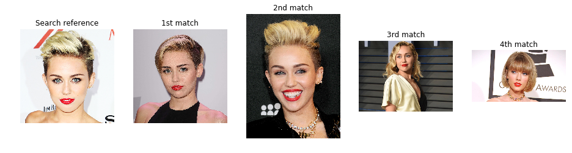

# Face search

This program implements very simple functionality: Reads image library from hard disk and detects the faces from the images. When user gives a reference image that contains a face, the program searches the library and gives the image that contains most similar looking face. 

Below is sample of the search result. The image on the left was used as a reference for the search and the four images on the right is the output from the algorithm. The number of results is configurable. This example is from photo library that contains 120 photos from approx 10 different persons (1:1 females and males). With that size library the search takes about 2 seconds (on 2015 MacBook Pro)

This was a fun weekend project that I did when I wanted to try how easily one can implement photo searching solution using machine learning algorithms in a 'transfer learning' way. Transfer learning means that the machine learning algorithms use parameters that have been trained earlier using similar data, i.e. there is no need for heavy processing to get benefits of the machine learning technology. If you have all the Python libraries installed, this program gives first results in a couple of minutes without any GPU acceleration or state-of-the-art CPU. 

# Implementation

This code is implemented fully in Python 3.6 in Jupyter Notebook format. 

This program uses two kinds of pre-trained algorithms:
* Haar cascade face detection from OpenCV.
* ResNet-50 convolutional neural network (CNN) from Keras library that has been trained using Imagenet data. 

The ResNet-50 model has been originally trained using Imagenet images that are categorized to 1000 classes (cats, dogs, cars, etc.). The model outputs the best matching class information when you input image to the model. Those classes are useless in this program, so in the code I modify the ResNet-50 by removing the original output layer and using the 2nd last layer as output. That layer is 1 x 2048 dimensional and the most interesting thing is that it contains much richer set of information than the original output, since it has not been force-trained to specific one-hot categories. In this use case it is not necessary to know what the output values mean, since we are only interested about the differences between images. 

In machine learning vocabulary the 2048 dimensional vector (and other vectors derived in similar way) are often called feature vectors or embedding vectors. Embeddings have useful characteristic that similar images produce embedding vectors that contain similar values. The similarity is typically measured by calculating euclidean distance or cosine distance between the vectors. In this program the cosine distance worked better, but the euclidean code is also available for anyone interested to try it. It will give slightly different results. 

The overall program process is following: 

__Image library analysis:__
1. Read images from library folder. 
2. Detect faces from the images using OpenCV Haar cascade detector. 
3. Crop the faces from the images. 
4. Scale the cropped face images to 224x224 pixels for ResNet-50 neural network model.
5. Feed the face images to ResNet-50 and read the output 2048 dimensional vectors. 
6. Save the vectors and image file paths for image searching purposes. 

__Image search:__ 
1. Read a reference image given by the user. 
2. Crop the face, run the face image to ResNet-50 and get the output vector. 
3. Calculate cosine distance from the reference image embedding vector to all library image embeddings. 
4. Select the library images that have smallest cosine distance to the reference image. 
5. Return the best match image paths to the user. 

I tested about half dozen different Keras pre-trained models and the ResNet-50 worked most predictably. 

Earlier version of this code used VGG16 model and PCA to reduce the output dimensionality. That version contained a bug in image preprocessing (wrong amplitude range) which made VGG16 work better than ResNet-50. After fixing the bug the ResNet-50 works significantly better in most use cases, so I made the change. It is easy to try different pretrained models in this program, since all model specific code is encapsulated in single class.

# Things to take into account

Since this is simple example that is intended for playing around with machine learning, it is not perfect. There are some things to take into account: 
* This program finds similar looking _images_ of faces. The face illumination, make-up, hair style and everything will affect the search results. The algorithm does not understand anything about the face itself, so be very careful if using solutions like this in any kind of face detection applications. It is very easy to fool this kind of face detection and comparison system. 
* The Keras ResNet-50 model is large and takes few hundred MB of disk space. It is automatically downloaded form Keras github when the model instance is created for the first time. Mac users may need to install Python certificates (Install Certificates.command) thanks to some recent (2018) changes in the Python certificates usage. 
* OpenCV Haar cascades are used for face detection. It is fast but has some limitations. It sometimes fails to detect angled faces, so one may want to consider using ensemble of different Haar cascades or CNN model to detect faces in all orientations if there is need to use this for any real applications.  
* Only one face is detected per image. The code should be simple to modify to detect all faces from the image, if there is need for it. 
* The Haar cascades may not work in Anaconda Python. Most likely the OpenCV version is way outdated in Anaconda, so I recommend manually installing the packages to normal Python environment. 
* Processing one image takes about one second in the library analysis phase (on a average laptop). Image search takes about one second. I haven't tested the performance with 'large' libraries (more than some hundred images).
